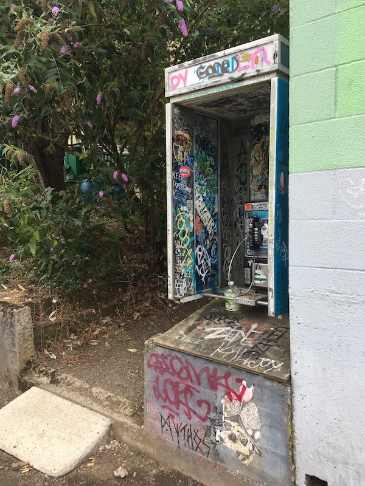

# 📞 Futel Missed Connections (Wishing Tree) on MLK 🌳
## Interactive phone tree for Open Signal and Futel's _Hold the Phone_

## Proposed Features:
* instruction menu available in English and Spanish
* listen to missed connections (by subject) from [start date] to [end date]
* listen to more info about missed connections (a version of the text above)
* listen to more information about the Wishing Tree on 7th
* listen to a missed connections message and get voicemail contact
* record a missed connection
  * record a subject (under 100 words)
  * record a message (under 90 seconds)
* reply to a message by recording a voicemail
* check your message's voicemail

## Concept and Implementation: 
Futel Missed Connections (alternatively titled _Wishing Tree_) on MLK will be an interactive phone menu inviting passerbys to record short, anonymous audio messages and play back recorded messages through a Futel public telephone on NE MLK.

This project draws inspiration from two place-based interfaces that explore and archive unfulfilled potentials, the local public art piece [_The Wishing Tree_ on 7th Ave](https://goo.gl/maps/xhifJZbhD5LvbJbz7), and the "Missed Connections" section of Craigslist and local newspapers .

I'm interested in the way the Missed Connections format draws out desires, dreams, and imagined potentials from passerbys in the public space. Often centered in urban areas and around transit, Missed Connections expose the lack of connection felt by "strangers" in the public space and the reality that while we exist with others in space, for good reasons it is not always safe, practical, or possible to connect. I see sites of recorded Missed Connections as a time and space superimposed on the city, which reveals fleeting senses of what could have been. In gathering these impressions of what-could-have been together, we can see a glimpse of a collective re-imagining of our local world.

I intend to borrow the Missed Connections format by creating an interactive voice menu on the Futel phone, which invites the user to record a subject and a message, as well as the option to listen to the list of record subjects, and select from that list to hear the corresponding messages.  This format was versatile enough to transfer from print to the web, and I believe a phone interface will be understood similarly. I'm excited to explore how the phone interface requires the user to slow down, because (as is often frustrating with phone menus) - the user must receive information at the speed of the playback and cannot "skim" as with text media. I'm also excited for the sound qualities that a variety of human voices will bring to a sort of poetic reading of subjects and messages imagined around NE MLK.

In addition to a menu to record a subject and message on the Futel phone, I hope to also connect anonymized voicemail boxes to the messages using the phone system. I believe creating the potential to connect will incentivize passerbys to record messages by creating a potential to explore those connections in space and time, and could help people learn about the features offered by the Futel public phones, like voicemail.

The second inspiration for this project comes from [_The Wishing Tree_](https://goo.gl/maps/xhifJZbhD5LvbJbz7), an interactive art piece located just a few blocks from Open Signal on NE 7th Ave. You can read more about this project's conceptual relationship with _The Wishing Tree_, as well as view some pictures and the letter I wrote to the person who maintains it [here](./WishingTreeOn7th.md).

## Maintenance:
After creating menu recordings and the interface for interacting with them, I intend to play a maintenance role in this project by moderating and curating the user-recorded content. The content is restricted to 5-10 messages, and since I want users to record a subject as well as an expanded message, I would limit the menu to listen to 5 messages at a time, which I would screen before they go live. The instructions for recording will include a brief Code of Conduct statement to discourage participants from sexual harassment, broadcasting personal information, and comments about eachother that are racist, homophobic, transphobic or generally harmful in other ways, which would lead to their recording being excluded from the phone menu. A better sense of the frequency people will make recordings is needed, but my thought for now would be to keep recordings up for 1 week, and air a new set of recordings each week.
