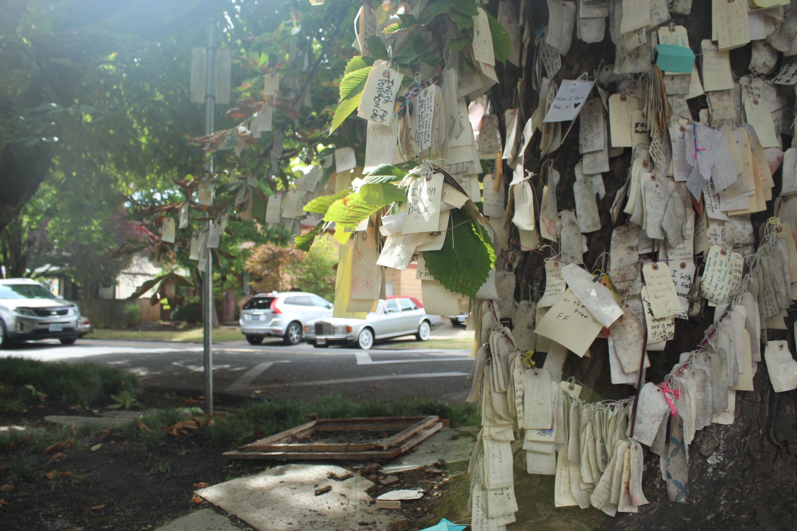
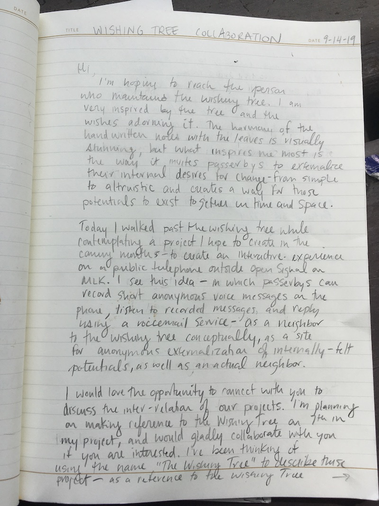
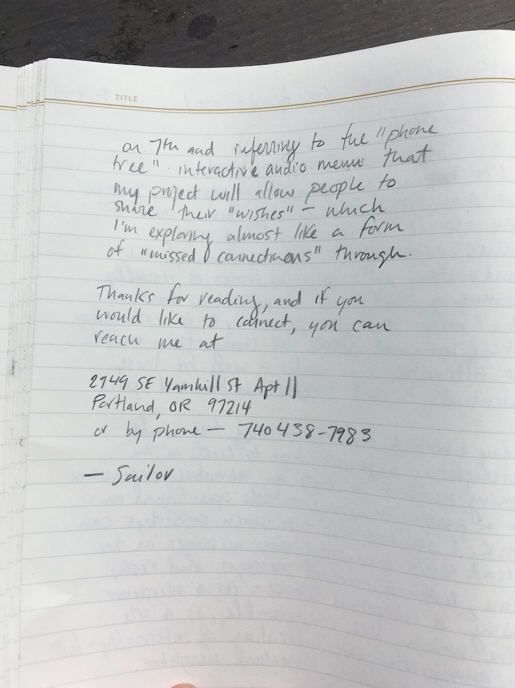
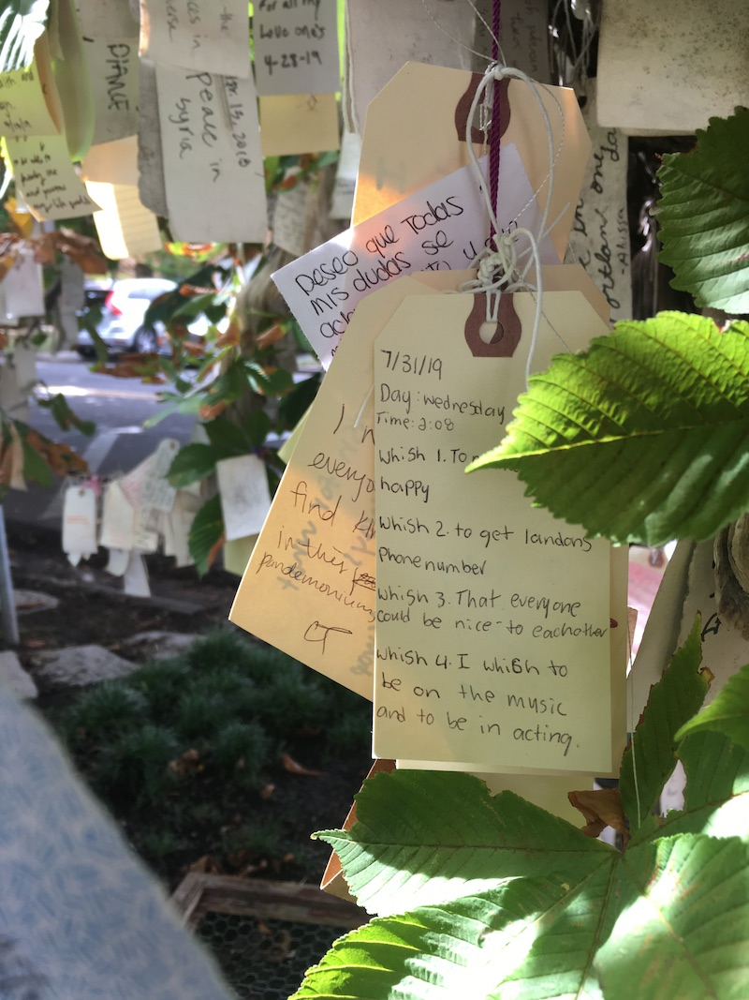
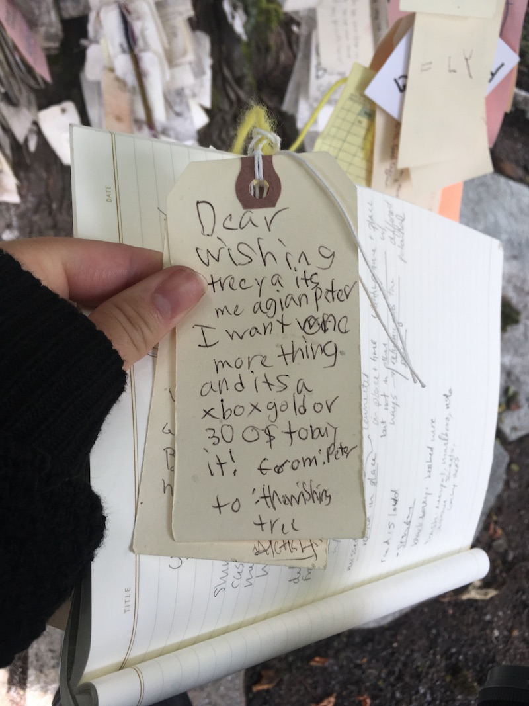
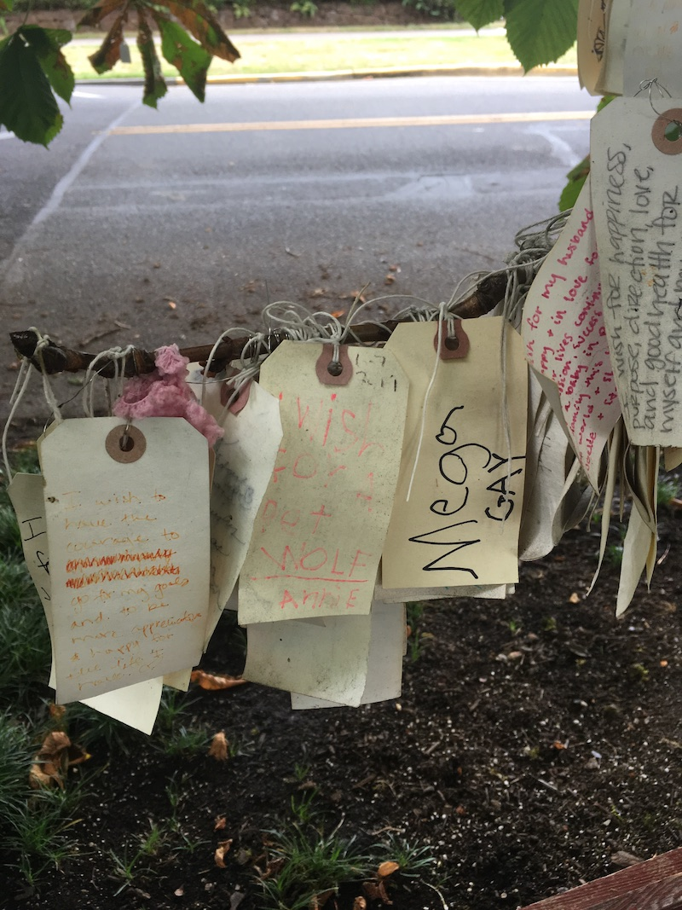

## The Wishing Tree on 7th Ave

Relationship and Correspondence

[_The Wishing Tree_](https://goo.gl/maps/xhifJZbhD5LvbJbz7) is an interactive art piece located just a few blocks from Open Signal on NE 7th Ave. Like Missed connections, _The Wishing Tree_ creates a collective externalization of internally-experienced desires in the form of "wishes," which passerbys are invited to record and hang on a tree. The wish tags describe human desires ranging from simple to altruistic, and taken together they create a stunning visual harmony with the tree's leaves that archive collective reimagining of the world - a world where we are granted Xboxes, crush's phone numbers, and world peace.

Because this project and  _The Wishing Tree_ on 7th are conceptual and geographical neighbors, I reached out to the maintainers of _The Wishing Tree_ on 7th by writing a letter and placing it in the mailbox of the house the tree is in front of. I'm interested in exploring a collaborating with the tree's maintainer(s) to create a dialogue between the two spaces, which are both "Wishing Trees," one virtual and one embodied. If the maintainer of the tree on 7th is interested, I would like to share a name, to observe the interaction between passerbys using Google Maps and Yelp, which both list the tree on 7th with the name _The Wishing Tree_, and the Futel installation at Open Signal just a few blocks away.

### Letter to Maintainers of the Wishing Tree on 7th

### More images from the Wishing Tree on 7th

